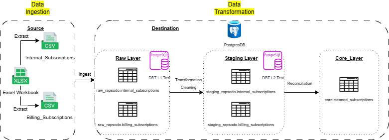

# Rapsodo - Senior Data Engineer Skills Assessment

This project focuses on the business problem:

> Rapsodo tracks subscriptions in two places: our internal app database, and our payment provider. These two systems don’t always agree — sync delays, provider outages, and a legacy double-write bug have left some records inconsistent. Enclosed within the provided Excel workbook are two exports representing the same underlying subscriptions from these two systems: internal_subscriptions and billing_subscriptions. They use different column names, different status vocabularies, and occasionally disagree with each other. Your task involves reconciling the two sources and identifying where and how they disagree. You may use SQL, Python, or both to complete this task, and your submission should include the accompanying code

## Project Architecture



## Project summary

This project satrt by implements an ELT pipeline to ingest subscription data from an Excel workbook into PostgreSQL, then validates, transforms, and reconciles it across dbt layers (raw, staging, core). The workflow includes data quality checks (L1 for raw data, L2 for cross-system relationships), transformation to standardized formats. Next, I reconcile the internal and billing datasets into trusted source-of-truth of each subscription, and categorization of subscribers by data quality issues. Detailed findings are documented in the sections below.

#### Reference:
- DBT L1 Test: [raw_layer_L1_Test](data-dbt/rapsodo/models/raw/validation)
- DBT Staging Layer: [staging_layer](data-dbt/rapsodo/models/staging/)
- DBT L2 Test: [staging_layer_L2_Test](data-dbt/rapsodo/tests/staging)
- DBT Core Layer: [core_layer](data-dbt/rapsodo/models/core/core__cleaned_subscriptions.sql)

---

## Project navigation
- Data ingestion: [data_ingestion.md](data_ingestion.md)
- Data transformation: [data-transformation.md](data_transformation.md)
- Data quality summary and coding notes: [Docs/Load_and_Clean_datasets_finding_coding.csv](Docs/Load_and_Clean_datasets_finding_coding.csv)
- Reconciliation: [Reconciliation](#Reconciliation) -> [Docs/Reconciliation.csv](Docs/Reconciliation.csv)
- User categoriazation: [User categorization](#User-Categorization) ->  [Docs/Users_Categorization.csv](Docs/Users_Categorization.csv)

---

## Data quality findings

#### Problem Statement:
>Load and clean both datasets. If you encounter any data quality issues, briefly summarize them here and comment your code where you handle them

#### Finding: [Docs/Load_and_Clean_datasets_finding_coding.csv](Docs/Load_and_Clean_datasets_finding_coding.csv)

The issues covered include:
- column name mismatches between billing and internal subscription datasets
- unclear timestamp field naming
- null handling and value standardization
- plan and status normalization
- duplicate detection and data quality classification

#### DBT Test scripts: [raw_layer_L1_Test](data-dbt/rapsodo/models/raw/validation)

## Reconciliation

#### Problem Statement:
>Reconcile the two sources by user and produce one output row per user classifying the result — for example: matched, missing_in_billing, missing_in_internal, status_mismatch, duplicate_internal_record. State and justify any tolerance you use to decide two records are “close enough” to match (e.g. timestamps a few hours apart).

I reconciled the internal and billing subscription datasets by user and categorized each record into a final status. I also built a severity framework to prioritize issues:

- P1 (Critical): Major technical or data discrepancies with severe business impact.
- P2 (Major): System or data inconsistencies with moderate/minor business impact.
- P3 (Minor): Low-severity anomalies with minimal operational impact.

Through cross-system reconciliation, I identified 9 distinct Data Quality issues and evaluated both their technical and business impacts before detailing root-cause fixes. Additionally, I provided the suggestion regarding to the issues to apply the root-cause fix. 
I applied a 2-hour tolerance window for timestamp discrepancies to accommodate normal sync delays and provider retries—treating records within 2 hours as synchronized, while flagging larger lags as late payment or late activation.

Key Findings:
- 10 subscribers were missing from billing_subscriptions.
- 8 subscribers were missing from internal_subscriptions.
- 60 subscriptions were activated within 2 hours of payment, while 47 experienced activation delays exceeding 2 hours.
- 18 subscriptions exhibited compound delays (both late payment and delayed activation).

Full breakdown and findings are documented here: [Docs/Reconciliation.csv](Docs/Reconciliation.csv)

#### DBT Models: [core_layer](data-dbt/rapsodo/models/core/core__cleaned_subscriptions.sql)

## User Categorization

#### Problem statement
>Summarize your findings: how many users fall into each category, and which category represents the biggest data quality risk in your view.

#### Findings: 

| category | dq_issue | dq_issue_risk_level | count
| --- | --- | --- | --- |
p1|status_mismatch|major_business_impact|103
p1|timestamp_difference|major_business_impact|98
p1|missing_in_billing|major_business_impact|10
p1|missing_in_internal|major_business_impact|8
p2|null_values_in_internal|minor_internal_impact|109
p2|null_values_in_billing|minor_business_impact|99
p2|duplicate_in_internal|major_internal_impact|8
p3|plan_values_misaligned|minor_internal_impact|143
p3|status_values_misaligned|minor_internal_impact|58

```bash
SELECT 
	category
	, dq_issue
	, dq_issue_risk_level
	, count(*)
FROM core_rapsodo.user_dq_issues_categorization
GROUP by category, dq_issue, dq_issue_risk_level
ORDER by category asc, count desc
```

#### Explanation:

P3 Category (Minor Operational Risk):
P3 issues affect all 143 subscribers for plan_values_misaligned and 58 subscribers for status_values_misaligned. These have minimal business risk and can be fully resolved in the transformation layer by creating standard dbt mapping models to standardized the values.

P2 Category (Internal System & Hygiene Risk):
P2 issues are dominated by null values in key timestamps. 109 subscribers in internal_subscriptions (last_updated_at) and 99 in billing_subscriptions (canceled_at). This leaves business users without clear visibility into subscription end or cancellation dates. Additionally, 8 duplicate subscribers exist in the internal system, which can be deduplicated using downstream dbt window functions (ROW_NUMBER()) and fix the root cause internally.

P1 Category (Highest Data Quality Risk):
P1 represents the biggest data quality risk overall. Note that the total P1 count (219 issue occurrences) exceeds the subscriber base because a single user can experience multiple P1 issues simultaneously (e.g., a subscriber having both a status_mismatch and a timestamp_difference). For example, subscriber, U1003 have 2 P1 issues `status_mismatch` & `timestamp_difference` at the same time.
- status_mismatch (103 records) and timestamp_difference (98 records) form the vast majority of P1 failures, causing severe state desynchronization between systems.
- 10 subscribers are missing from the billing system (unbilled access leading to potential revenue leakage).
- 8 paying subscribers are missing internally (service lockout risking customer churn and brand damage).

#### Full list of data: [Docs/Users_Categorization.csv](Docs/Users_Categorization.csv)

#### DBT Model: [core_layer](data-dbt/rapsodo/models/core/core__user_dq_issue_categorization.sql)


